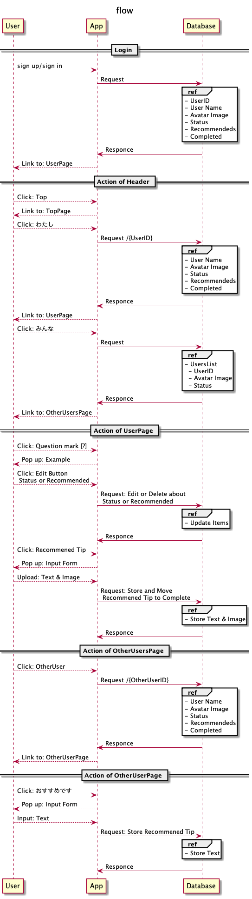
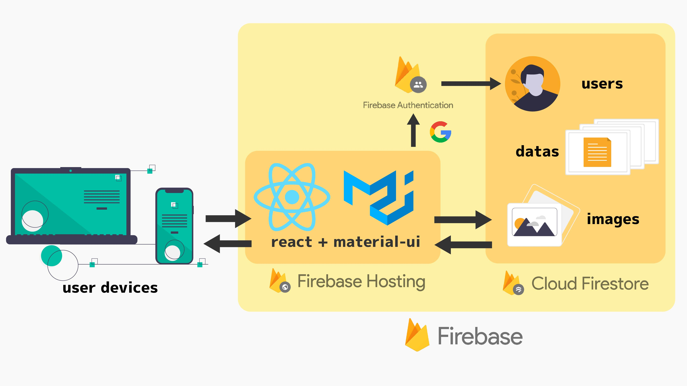

# 仕様書
## アプリのコンセプト
「やったことのない事柄を人からのおすすめを通して（軽く）やってみよう」 + 「未経験者にほんの簡単な行動をおすすめして一歩を踏み出してもらおう」

このアプリは、自分のやったことない事（趣味など）を登録し、その属性から「時間をあまり取らず」「はじめの一歩として相応しい」行動を人におすすめし、人からおすすめされるアプリ。

おすすめする側はおすすめする「行動」を**できるだけ具体的に**書いてもらい、ユーザは気に入った「行動」を実行する。
その結果や過程などを投稿することができる。
ユーザは自分の知らない分野の**始まりの行動、チュートリアルのようなもの**を体験し、自分の世界を広げることができ、また自分の好きな分野を初心者に興味を持ってもらうことができる。

## アプリの流れ
- Googleアカウントでログイン
- 自分のページについて
    - 何の初心者か入力してもらう
    - 他のユーザーからおすすめしてもらった行動を行う
    - 行った行動を写真や文章で投稿
- 他のユーザーのページについて
    - ユーザーリストのページからみんなが何の初心者か知る
        - 
    - 自分がおすすめできそうな人を選択
    - その人のページでおすすめ行動を入力

## 主な機能
- 自分のページ
    - 自分が何の初心者が入力する機能
    - おすすめされた行動を消化したら、それの写真とテキストをアップロードする機能
- 自分以外のページ
    - 他の人に行動をおすすめする機能

## フロー図
まだ暫定

### アプリ名（まだ未決定）
- ちょいといっぽ
- ほんの一歩
- かるくいっぽ
- チョビットいっぽ

## 画面遷移
[Figmaを参照](https://www.figma.com/file/rvQ8Gh5RKixeuJxIh8BsHo/%E3%83%97%E3%83%AC%E3%83%A4%E3%83%95Hack-U-team1?node-id=60%3A277)
- 2つあるけど、右側の方

## 技術

### frontend
- react
- material-ui

### database
- Cloud Firebase

### Authentication（ユーザー認証）
- Firebase Authentication + Google アカウント

### deploy
- Firebase Hosting

## ER図

